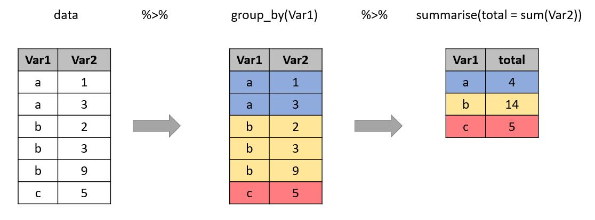

# Setting up our project

In this activity you'll get an idea of how to work with `dplyr` to manipulate your data. It's a flexible and readable way to work with data after a little bit of practice! The goal for this activity should be to gain familiarity with the main data verbs (I'll explain what those are later!) and start to develop some intuition for when to use each one, and in what order. 

We are using data from fivethirtyeight's github page on political donations from the STEM community [metadata](https://github.com/fivethirtyeight/data/tree/master/science-giving). The data were featured in the article [when scientists donate to politicians, it's usually to democrats](https://fivethirtyeight.com/features/when-scientists-donate-to-politicians-its-usually-to-democrats/). 

## Assumed knowledge

For this particular activity, I assume you have some familiarity with

* RMarkdown

* Dataframes in R (have a general idea of what they are and how to work with them)

* `ggplot2` (optional!)

## Loading packages and data

We will load the `tidyverse` package since it includes more than just `dplyr`. We will also load the `lubridate` package for one question that involves formatting dates. 

```{r warning=FALSE, message = FALSE}
# if you need to install tidyverse, the code is install.packages("tidyverse")
library(tidyverse)
library(lubridate) # install with install.packages("lubridate")
```

I like loading from the github page, and in this case it looks like the `fivethirtyeight` package does not yet include this data! When you load this, you'll notice it takes a while. With this in mind, write {r cache=TRUE} in place of the usual {r} at the top of the chunk. This caches (saves) your data so that it doesn't have to load every time you knit. But also with this in mind, be careful that loading the data is the only code in that chunk! You don't want to cache other things. 

```{r cache=TRUE, message = FALSE, warning=FALSE}
# from the github url
donations <- read_csv("https://media.githubusercontent.com/media/fivethirtyeight/data/master/science-giving/science_federal_giving.csv")

```

This table is quite large-- in fact it has 881793 observations. We are going to take a random sample of 100000 entries so that it's a little easier to work with. We will use `sample_n()` to take a random sample of n observations (our first dplyr function!). 

```{r}
donations_small <- sample_n(tbl = donations, size = 100000) # take a sample of 100000 observations from the donations table. 
```

```{r}
str(donations_small)
```

# Data wrangling

## Data verbs

`dplyr` works by using data verbs to act on your data. The same way we use verbs to signal action in a natural language, data verbs perform an action on data. I'll divide them into some broad categories to start, then give you some practice questions to bring it all together! Similar to `ggplot2`, dplyr uses a layering framework, so you'll start to see repeated patterns pretty quickly! `dplyr` layers through pipes (`%>%`). In essence, data "flows" through the pipes. This is helpful because it takes out the need for intermediate tables when you are wrangling. The structure is best explained through examples, but the most important thing to note is that when you're using pipes you don't need to specify a dataframe in your data verb function. And **order matters** for the data verbs!

## Column verbs: mutate and select

`select()` and `mutate()` perform actions on columns (as opposed to rows). `select()` pulls out (or drops) columns that you specify. `mutate()` creates new columns.

Our `donations_small` table has 31 variables, and chances are pretty good we don't need all of them. Let's get rid of some!

```{r}
donations_small_select <- # name the new table
  donations_small %>% # start with the original table, then pass that down to the next function with a pipe (%>%)
  select(c("cand_name", "cand_pty_affiliation", "cleanedoccupation", "transaction_dt", "transaction_amt", "city", "state", "zip_code", "cycle")) # pass a vector of column names that you want to select from the original data. 

str(donations_small_select) # now there are only 9 variables!
```

The format of the transaction date (`transaction_dt`) right now is a little hard to read (MMDDYYYY). We can use the `lubridate` package to make them more human-readable. The function `mdy()` (from lubridate) takes a date in "month day year" and converts it to "year-month-day". It also then stores that value as a date object!

```{r}
donations_small_mutate <- # create a new table
  donations_small %>% # start with our original data and pass it down to the mutate function
  mutate(date_formatted = mdy(transaction_dt)) # create a new variable called date_formatted that is the output from the mdy() function

str(donations_small_mutate)
```

## Row verbs: filter and arrange

`filter()` and `arrange()` perform actions on the rows of our dataframe. `filter()` takes out observations we don't want and `arrange()` sorts our data however we specify!

This data is pretty messy! At least for me, one of the most important variables is the transaction amount (`transaction_amt`), but there are quite a few `NA` values in the data. Let's `filter` out the `NA` cases!

```{r}
donations_small_filter <- # create a new table
  donations_small %>% # start with our original data and pass it down to the mutate function
  filter(!is.na(transaction_amt)) # this says "take out any na amounts". The "!" means "not", so the whole function is finding any "not na" values

str(donations_small_filter)
```

But now if we look at the data there are a few negative transaction amounts. There's probably a reason for that, but in my little bit of googling I didn't find a good explanation. For the sake of learning about using multiple arguments with `filter()`, let's take them out!

```{r}
donations_small_filter <- 
  donations_small %>% # everything up to this point is the same as the last chunk
  filter(!is.na(transaction_amt), transaction_amt > 0) # add the second filter condition (positive amount) with a comma after the first condition. The comma means "and". To do "or" you can use "|". 

str(donations_small_filter)
```


## Group verbs: group_by and summarise

We can also perform actions on a "group" of variables. You can think of this as changing the case/observation in your table. A case/observation is what one row represents. In the `donations` table, a case/observation is one particular transaction. `group_by()` and `summarise()` work together to help us manipulate the observations. 

`group_by()` specifies how we want to group our observations (what variable will serve as the base of our obeservation) and `summarise()` specifies how we want to talk about those groups. Questions that require grouping often have "per" or "by" somewhere in them, or some variation of that. I think seeing this is a picture helps!



Let's find total donations **per** candidate. In this question we will see a longer series of functions with pipes!

```{r}
donations_small_cand_groups <- # create a new table
  donations_small %>% # start with the original data and pass it down to group_by
  group_by(cand_name) %>% # we are counting per candidate, so that's the grouping variable
  summarise(total = sum(transaction_amt, na.rm = TRUE)) # create a new variable that sums the transactions for each candidate (removing the na values with na.rm = TRUE) then save it as "total". The new variable name can be anything! You aren't bound to using "total". 

str(donations_small_cand_groups)
```

**Notice** that this new table has only 2 variables! What happened?! If you group your observations, it won't keep any information aside from the grouping variable and the summarised information. There are some tricks to save more information, but we can talk about those later.


Let's also find the total donations per occupation type. 

```{r}
donations_small_occ_groups <- # create a new table
  donations_small %>% # start with the original data and pass it to group_by
  group_by(cleanedoccupation) %>% # we are counting per occupation, so that's the grouping variable
  summarise(total = sum(transaction_amt, na.rm = TRUE)) # the summarise function is the exact same as the one above! Even though we are using different groupings. 

str(donations_small_occ_groups)
```

